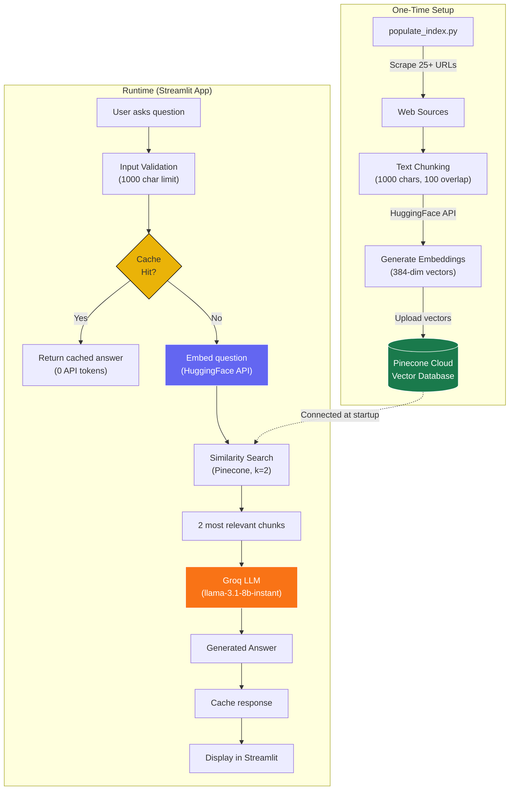
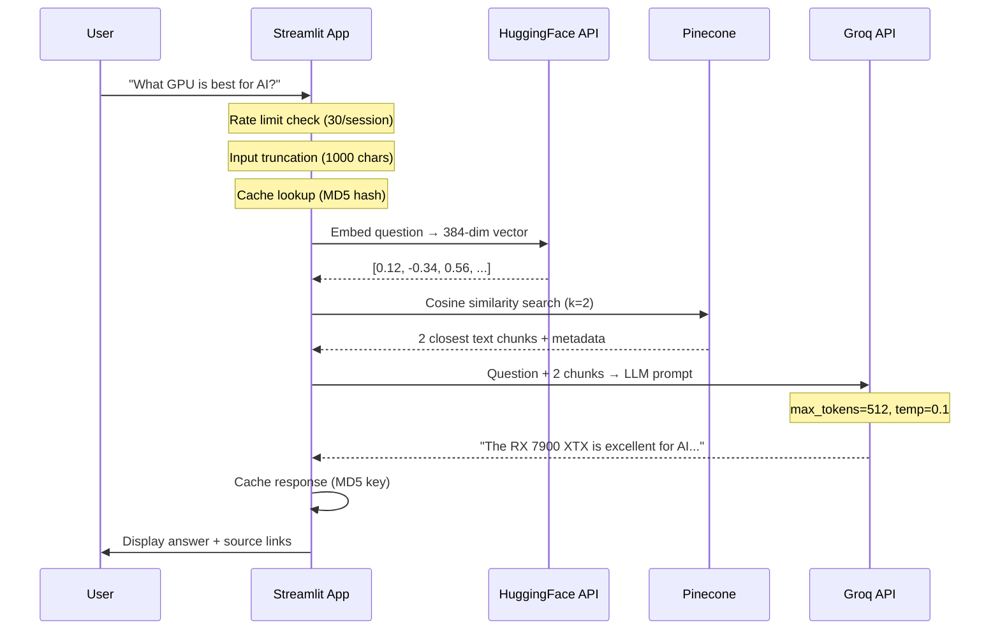
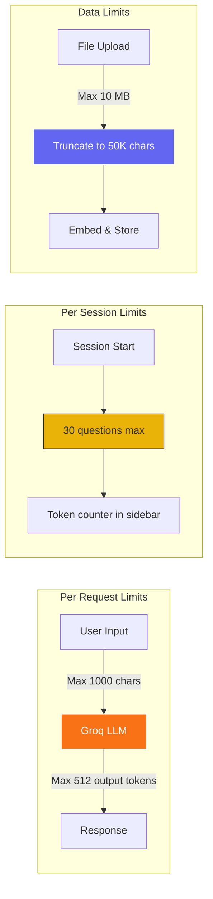

# RAG Knowledge Chatbot

A cloud-deployable **RAG (Retrieval-Augmented Generation)** chatbot that builds a knowledge base from web URLs and documents, then answers questions using AI. Powered by **Groq** for fast LLM inference, **Pinecone** for persistent vector storage, and **HuggingFace** for embeddings.

[](https://share.streamlit.io)
[](LICENSE)

## Features

- **Cloud-Native Architecture** — No local servers, models, or GPUs required
- **Persistent Vector Store** — Pinecone stores embeddings permanently (survives restarts)
- **Fast LLM via Groq** — Sub-second responses using `llama-3.1-8b-instant`
- **Web Scraping** — Add knowledge from any public URL
- **File Upload** — Upload `.txt` files to expand the knowledge base
- **Response Caching** — Repeated questions served instantly (zero API cost)
- **Rate Limiting** — Built-in session limits to control API token usage
- **Token Tracking** — Live usage stats in the sidebar
- **Streamlit Cloud Ready** — One-click deploy with zero infrastructure

## Architecture

### High-Level System Flow



### RAG Pipeline Detail



### API Token Flow & Limits



## Tech Stack

| Component | Service | Free Tier |
|-----------|---------|-----------|
| **LLM** | [Groq](https://console.groq.com) | 14,400 requests/day |
| **Embeddings** | [HuggingFace Inference API](https://huggingface.co/settings/tokens) | Rate-limited, free |
| **Vector DB** | [Pinecone](https://app.pinecone.io) | 100K vectors, 1 index |
| **Hosting** | [Streamlit Cloud](https://share.streamlit.io) | Free for public repos |

## Project Structure

```
Local-Knowledge-Chatbot/
├── main.py                          # Streamlit app (entry point)
├── populate_index.py                # One-time script to load data into Pinecone
├── requirements.txt                 # Python dependencies
├── .env.example                     # Environment variables template
├── .streamlit/
│   ├── config.toml                  # Streamlit server & theme config
│   └── secrets.toml.example         # Secrets template for Streamlit Cloud
├── LICENSE                          # MIT License
└── README.md                        # This file
```

## Quick Start

### 1. Get API Keys (Free)

| Service | Link | Key Name |
|---------|------|----------|
| Groq | [console.groq.com/keys](https://console.groq.com/keys) | `GROQ_API_KEY` |
| HuggingFace | [huggingface.co/settings/tokens](https://huggingface.co/settings/tokens) | `HUGGINGFACE_API_KEY` |
| Pinecone | [app.pinecone.io](https://app.pinecone.io) | `PINECONE_API_KEY` |

### 2. Clone & Configure

```bash
git clone https://github.com/sayon999-d/Local-Knowledge-Chatbot.git
cd Local-Knowledge-Chatbot
pip install -r requirements.txt
```

Create a `.env` file:

```env
GROQ_API_KEY=gsk_your_key_here
HUGGINGFACE_API_KEY=hf_your_key_here
PINECONE_API_KEY=pcsk_your_key_here
PINECONE_INDEX_NAME=rag-chatbot
```

### 3. Populate the Vector Store (One-Time)

```bash
python populate_index.py
```

This scrapes all URLs, embeds the content, and uploads to Pinecone. Run this **once** — data persists permanently.

### 4. Run Locally

```bash
streamlit run main.py
```

Open [http://localhost:8501](http://localhost:8501) in your browser.

## Deploy to Streamlit Cloud

### Step 1: Push to GitHub

```bash
git add -A
git commit -m "cloud deployment ready"
git push origin cloud-deploy
```

### Step 2: Connect to Streamlit Cloud

1. Go to [share.streamlit.io](https://share.streamlit.io)
2. Click **"New app"**
3. Select your repo: `sayon999-d/Local-Knowledge-Chatbot`
4. Branch: `cloud-deploy`
5. Main file: `main.py`

### Step 3: Add Secrets

In the Streamlit Cloud dashboard → **Settings** → **Secrets**, paste:

```toml
GROQ_API_KEY = "gsk_your_actual_key"
HUGGINGFACE_API_KEY = "hf_your_actual_key"
PINECONE_API_KEY = "pcsk_your_actual_key"
PINECONE_INDEX_NAME = "rag-chatbot"
```

### Step 4: Deploy

Click **"Deploy"** — your app will be live at `https://your-app.streamlit.app` 🚀

## Usage

### Asking Questions

Type any question in the chat input. The AI will:
1. Search Pinecone for the 2 most relevant knowledge chunks
2. Send the question + context to Groq's LLM
3. Display the answer with clickable source links

### Adding New Knowledge

Use the sidebar to add knowledge at any time:

- **Web URL** — Paste a link, click "Scrape URL". Content is scraped, embedded, and stored in Pinecone permanently.
- **File Upload** — Upload a `.txt` file (max 10 MB). Content is chunked and stored in Pinecone.

### Monitoring Usage

The sidebar shows:
- A progress bar for session question count (max 30)
- Approximate token usage
- Current model and token limits

## Configuration

All limits are configurable at the top of `main.py`:

```python
MAX_QUESTION_LENGTH = 1000       # Max characters per question
MAX_GROQ_TOKENS = 512            # Max output tokens per LLM response
MAX_QUESTIONS_PER_SESSION = 30   # Rate limit per session
MAX_FILE_UPLOAD_MB = 10          # Max upload file size
MAX_FILE_CONTENT_CHARS = 50000   # Truncate file content to save tokens
```

To use a different LLM model, set the `GROQ_MODEL` environment variable:

```env
GROQ_MODEL=llama-3.3-70b-versatile    # More capable, slower
GROQ_MODEL=llama-3.1-8b-instant       # Faster, default
GROQ_MODEL=mixtral-8x7b-32768         # Good balance
```

## Troubleshooting

| Issue | Solution |
|-------|----------|
| `GROQ_API_KEY not set` | Add it to `.env` (local) or Streamlit Secrets (cloud) |
| `PINECONE_API_KEY not set` | Get a free key at [app.pinecone.io](https://app.pinecone.io) |
| `Rate limit reached` | Refresh the page to reset the session counter |
| `Initialization error` | Check that `populate_index.py` was run and the Pinecone index exists |
| Slow responses | Switch to `llama-3.1-8b-instant` model (default) |
| Empty answers | Run `populate_index.py` to populate the knowledge base |

## License

This project is licensed under the MIT License — see the [LICENSE](LICENSE) file for details.

## Acknowledgments

- [LangChain](https://www.langchain.com/) — RAG framework
- [Groq](https://groq.com/) — Ultra-fast LLM inference
- [Pinecone](https://www.pinecone.io/) — Serverless vector database
- [HuggingFace](https://huggingface.co/) — Embedding models
- [Streamlit](https://streamlit.io/) — App framework and cloud hosting
